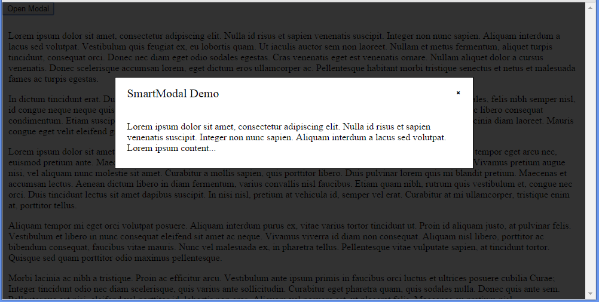
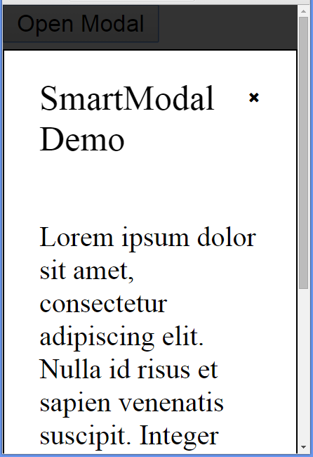

# jquery-SmartModal
jQuery plugin SmartModal for creating adaptive modal windows with static background.


*At desctop*


*Adaptive*


## Installation

Include script *after* the jQuery library (unless you are packaging scripts somehow else):

```html
<script src="/js/jquery.smartmodal.js"></script>
```

And inlude css-file or copy styles to your css-file (you can change styles at SASS file [SCSS syntax])

```html
<link href="/css/style.css" rel="stylesheet" type="text/css">
```

## Usage

Create button that will be open your modal:
```html
	<button class="test_modal_btn">Open Modal</button>
```

And create hidden element with content for your window:
```html
  <div class="modal-demo-content" style="display: none">
		Lorem ipsum dolor sit amet, consectetur adipiscing elit. 
		Nulla id risus et sapien venenatis suscipit. Integer non 
		nunc sapien. Aliquam interdum a lacus sed volutpat. 
	  Lorem ipsum content...
	</div>
```

Then create your window and define btn listener:

```javascript
	// $.smartModal.create(windowTitle, contentElementSelector, yourWindowCustomName);
	$.smartModal.create('SmartModal Demo', '.modal-demo-content', 'TestModalClass');
	
	// $(actionBtnElementSelector).on ( 'click', function () {$.smartModal.open(yourWindowCustomName);});
	$('.test_modal_btn').on ( 'click', function () {$.smartModal.open('TestModalClass');});
```

And init plugin after all modal windows defining
```javascript
  $.smartModal.init(); // or $.smartModal.init('smartModal', 'wrapper');
```

## Authors

[Denis Dragomirik](https://github.com/denikeweb)
